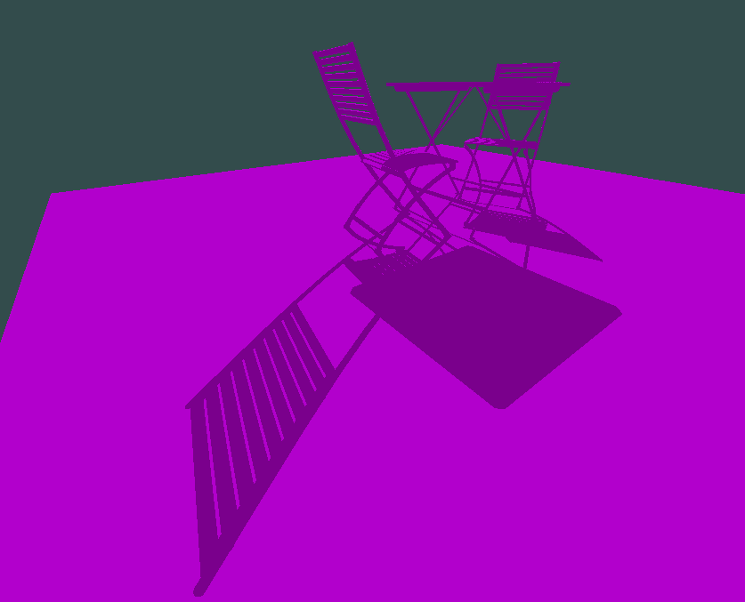

# Conclusions

## Word about current status

As of this writing, the current implementation is working but very basic. Thus
I deem project finished and **WILL NOT BE WORKING ON IT ANYMORE**.
Even so, it already has 60 fps with given scene except when you go close to an
object. This issue is discussed in next sections.

## This implementation

The shadowing works in basically three stages: run a basic OpenGL renderer
which generates a frame, except for each pixel we also store unique 3D point
(sample) used, then in light space coordinates we cluster points into bins of
a 2D uniform grid, and finally we treat this uniform grid as an image plane
which is used to perform conservative rasterization of our scene which tells
us for each triangle which bin it could be occluding, and so we test for each
point in that bin, if it is, or not, occluded (shadowed).

Two things to note here: for each point we test if it is visible from the light,
which is basically the approach in ray tracing, and second, the only acceleration
done here is that of (conservatively) rasterising our scene to NOT have to 
perform a `for all triangles; for all points; test shadow` loop. Instead
currently it is more like a `for all triangles; for only points in my bins;
test shadow`.

## Possible optimisations

Right now our implementation calculates the bounding box of the whole scene
in light space and cuts it into the 2D uniform grid used for binning. This makes
it so when we get too close to an object, all of the 3D points sampled may
fall into same bin, because relatively to the whole scene they are very close.
Potentially millions of them may be in one bin. This leads to sequential
processing times. A better approach would be to recalculate our bounding box
so that it tightly contains our sampled points and uniformly cuts *that* out.
This will not only result in low bin loads but also allow for triangle culling.

## Existing works

Instead of exploring this technique further we realise there is not much to
discover before we starting dabbling into ray tracing territory. To this end
we will just mention main existing works that can be used to have a fairly
scalable real-time shadows based on IZB. First the original paper: The Irregular
Z-Buffer and its Application to Shadow Mapping, and second a master thesis
Fast Triangle Rasterization using Irregular Z-Buffer on Cuda.

The master thesis explores different acceleration techniques, including the ones
we talked about above. It's results are shown for low resolution 512x512 images,
but it is a proof of real-time scalibility.

There is also Frustum-Traced Raster Shadows: Revisiting Irregular Z-Buffers.

## Why Ray-Tracing is winning

Note that the bottleneck of this technique is the balance of bin load. However
this is also it's main selling point. We can get alias-free hard shadows at
interactive rate using rasterisation (on the bin grid) that match the precision
of a ray tracer. The appeal of IZB is starting to fall out because ray tracing
techniques have started to become feasiable on modern hardware and is naturally
starting to win, because it gives us much more advantages than shadows; it gives
us much more realistic rendering opportunities.

## Why Irregular Z-Buffering is still cool

All in all it is a very performant technique and not too complex and only
requiring very simple optimisations to scale it for getting good shadows with
1600x800 resolution and fairly complex scenes. Especially see a work from
[nvidia](https://research.nvidia.com/publication/2015-02_frustum-traced-raster-shadows-revisiting-irregular-z-buffers).
